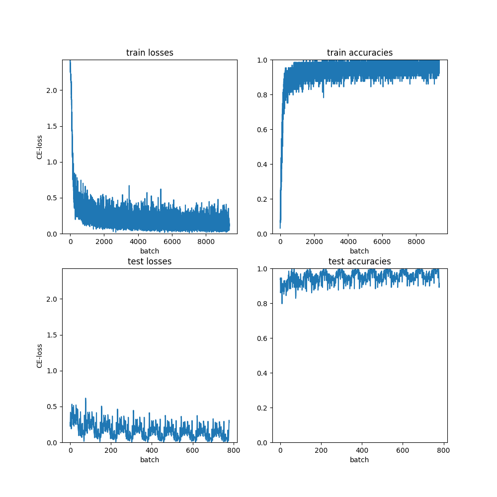

# LeNet from scratch

This is a C++ 11 implementation of LeNet-like network learning MNIST dataset.
No third-party library is ever used, even matrix manipulation routines.
Since the program runs in one thread, it's not fast at all.
Thus it's purpose is solely for better comprehension of the basics of back propagation.

The implementation is partially inspired by Fei-Fei Li & Justin Johnson & Serena Yeung's slides, and the figure exerpted from ["Back Propagation in Convolutional Neural Networks -- Intuition and Code"](https://becominghuman.ai/back-propagation-in-convolutional-neural-networks-intuition-and-code-714ef1c38199).

Why the code is called `ex5_10`?
The idea of initiating the project comes from an attempt to finish the 5-10 exercise of "Machine Learning" book composed by professor Zhou, Zhihua.

## Build

You'll need GNU make.

To build with runtime assertions, etc., simply

```bash
make
```

then run with `./a.out`.

To remove assertions and compile with optimization,

```bash
make ex5_10
```

then run with `./ex5_10`.

To actually produce some results in reasonable time, you'll want to run with `./ex5_10`.

## Tests

All functions tested are marked `// Tested` above their signatures.
The test of convolution, one of the hardest operation for me, is recorded in `test_ex5_10.cpp` specifically.
Only `assert` macro from `<cassert>` is used.
No third-party dependencies.

## Get MNIST

```bash
cd ex5_10assets
bash fetch_mnist.sh
```

## Network structure

Basically, two 5x5 convolution layers followed by three linear layers.
Please refer to the code for detail.

## Training details

Use mini-batch of batch size 64.
Optimized with plain old Stochastic Gradient Descent (SGD) (with mini-batch of course).
Inverse-scaling learning rate: `eta = eta0 / sqrt(t / 50 + 1)`.
Initial learning rate 0.01.
Shuffling of training set before each epoch.
Number of epochs: 10.

## Training results

Plotted using `plot.py`.
Dependency: `matplotlib`.


